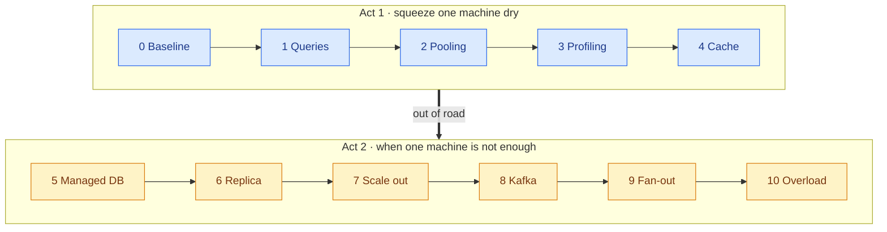
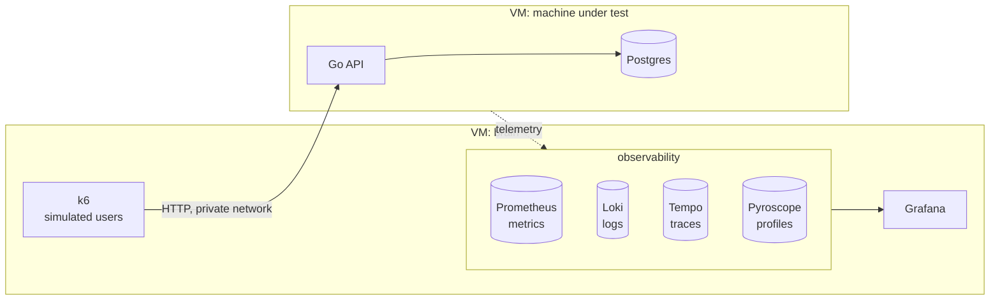

# StressLab

**How much can one small machine *really* take — and how much more can you squeeze out of it?**

One Go API, one Postgres, one Azure VM. Find the limit, fix what broke, measure again — one
change at a time. Scale out only when the numbers say one machine is out of road.

**[Spec](docs/SPEC.md) · [Methodology](docs/METHODOLOGY.md) · [Architecture](docs/ARCHITECTURE.md) · [Roadmap](docs/ROADMAP.md)**

> 🚧 **Status: building the lab.** No runs yet — every number here will come from a committed
> run in `runs/`.

## Results

| Step | Change | Max users | Req/s | p95 | What broke next | $ / hour |
|---|---|---|---|---|---|---|
| 0 | Baseline | — | — | — | — | — |

*Generated from `runs/` by CI — never typed by hand.*

## The ladder

## The lab

**Stack:** Go · Postgres · Redis · Kafka (Event Hubs) · k6 · Prometheus · Loki · Tempo ·
Pyroscope · Grafana · Docker · Terraform · Ansible · GitHub Actions · Azure

---

Inspired by Arjay's [I Tested 8 Programming Languages on a $12 Server](https://www.youtube.com/watch?v=sQXFhh_PiG4) —
StressLab holds the language still and asks what else there is to squeeze.
