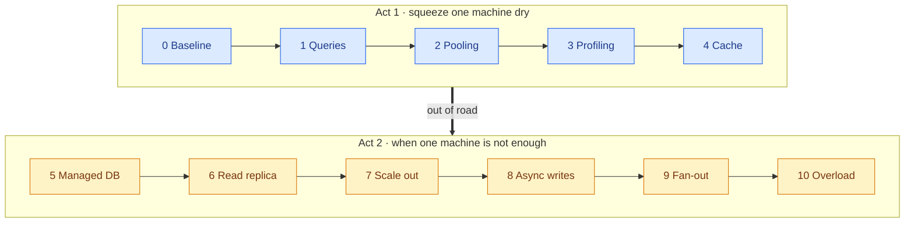
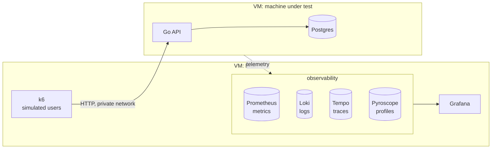

# StressLab

**How much can one small machine *really* take — and how much more can you squeeze out of it?**

One Go API, one Postgres, one Azure VM. Find the limit, fix what broke, measure again — one
change at a time. Scale out only when the numbers say one machine is out of road.

**[Spec](docs/SPEC.md) · [Methodology](docs/METHODOLOGY.md) · [Architecture](docs/ARCHITECTURE.md) · [Roadmap](docs/ROADMAP.md)**

> 🚧 **Status: building the lab.** No runs yet — every number here will come from a committed
> run in `runs/`.

## Results

| Step | Change | Max users | Req/s | p95 | What broke next | $ / hour |
|---|---|---|---|---|---|---|
| 0 | Baseline | — | — | — | — | — |

*Generated from `runs/` by CI — never typed by hand.*

## How it's measured

- **One change per step.** Same app, data, load and machine — only the thing being tested differs.
- **The bar:** p95 < 500 ms, p99 < 1 s, errors < 1%. A level counts only if **three 5-minute runs
  all pass**.
- **Past the limit too:** load at up to 2.5× the limit shows whether the system bends or
  collapses — with and without load shedding.
- **Honest runs:** runs where the load generator or the hardware was the problem are marked
  invalid, not counted. Steps that didn't help still get a row.

## The ladder

<b>The question each step answers</b>

| Step | The question |
|---|---|
| **0** Baseline | Where does a plain setup break, and why? |
| **1** Queries | How much was just bad queries? |
| **2** Pooling | Are requests waiting on the database, or on a connection to it? |
| **3** Profiling | When does the Go side start to matter? |
| **4** Cache | Is a cache worth the CPU it steals from the database? |
| **5** Managed DB | What does the network hop cost, and what does "managed" buy? |
| **6** Read replica | What changes when reads and writes go different ways? |
| **7** Scale out | Does more API help, or just hit the database harder? |
| **8** Async writes | What do you trade for cheap writes? *(Kafka API on Azure Event Hubs)* |
| **9** Fan-out | Build feeds on read or on write — and what does a celebrity do to it? |
| **10** Overload | Past the limit, does it bend or break? |

## The lab

**Built with** Go · Postgres · k6 · Grafana · Docker · Terraform · Ansible · Azure

---

Inspired by Arjay's [I Tested 8 Programming Languages on a $12 Server](https://www.youtube.com/watch?v=sQXFhh_PiG4) —
StressLab holds the language still and asks what else there is to squeeze.
