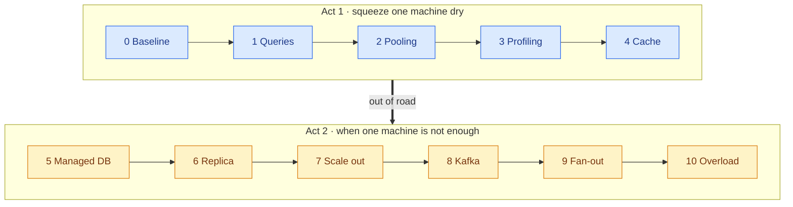
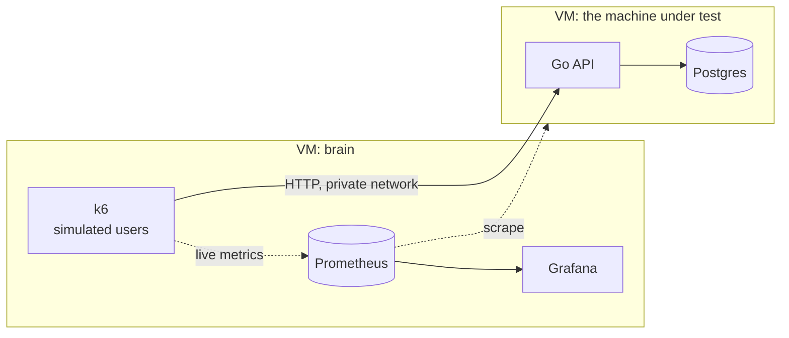

# StressLab

**Have you ever wondered how much a single machine can *really* take?**

Not "add more servers". Not "it depends". One small cloud VM, one Go API, one Postgres —
how many people can use it at the same time before it breaks? And once it breaks, **how much
more can you squeeze out of the exact same hardware**, one measured change at a time?

StressLab finds out. Then, only when the numbers prove one machine is out of road, it scales
out — and measures what every extra dollar buys.

> 🚧 **Status: design.** The method and the ladder are written down; the first run hasn't
> happened yet. Every number on this page will come from a committed run in [`runs/`](runs/) —
> none of them are guesses.

## The results

| Step | What changed | Max users | Req/s | p95 | What broke next | $ / month |
|---|---|---|---|---|---|---|
| 0 | Baseline | _TBD_ | _TBD_ | _TBD_ | _TBD_ | $0 |
| … | one change per row | | | | | |

*One row per experiment. The "what broke next" column is the point: every step moves the
bottleneck somewhere new, and the next step goes after it.*

## The rules of the fight

Every step is a controlled experiment, so a gain can only come from the one thing that changed.

1. **One change per step.** Same app, same data, same load, same thresholds — except the one
   thing being tested.
2. **Same load every time.** Simulated users browse a Twitter-style feed, open posts, like,
   and post — with real think times, not a firehose. ~10 users ≈ 1 request/second.
3. **Same bar every time.** A level only *passes* if **p95 < 500 ms, p99 < 1 s and errors < 1%**
   — first over 2 minutes, then confirmed over 5.
4. **Every run is committed.** Settings, results, CPU over time, and the price. Two runs with
   different fixed settings refuse to be compared.
5. **Honest negatives.** A change that didn't help gets its row too.

## The ladder

| Step | What changes | The question it answers |
|---|---|---|
| **0** | Go + Postgres on one VM, defaults | Where does a plain setup break, and why? |
| **1** | `EXPLAIN ANALYZE`, indexes, a stored like count | How much was just bad queries? |
| **2** | PgBouncer, pool-size sweep | Are requests waiting on the database, or on a connection to it? |
| **3** | `pprof` flame graphs, GC tuning | When does the Go side start to matter? |
| **4** | Redis next to Postgres, same box | Is a cache worth the CPU it steals? |
| **5** | Azure managed Postgres | What does the network hop cost, and what does "managed" buy? |
| **6** | A read replica | What changes when reads and writes go different ways? |
| **7** | Autoscaling API containers | Does more API help, or just hit the database harder? |
| **8** | Likes become Kafka events, written in batches | What do you trade for cheap writes? |
| **9** | Follows + personal feeds, fan-out as a Kafka consumer | Fan-out on read or on write, and what does a celebrity do to it? |
| **10** | Push 2× past the limit, with and without load shedding — then kill the database | Does it bend, or break? |

**The rule between the acts:** Act 2 starts only when Act 1's numbers show one machine is out
of road.

## What's under test

The load generator and the monitoring stack live on **their own VM**, so neither steals CPU
from the machine being measured.

## The stack

| | |
|---|---|
| **App** | Go (standard library HTTP), Postgres |
| **Load** | k6 |
| **Events** | Kafka (Azure Event Hubs) |
| **Watching** | The full Grafana stack, self-hosted: Prometheus, Loki, Tempo, Pyroscope — metrics, logs, traces and profiles, all linked. SLOs with error budgets |
| **Cloud** | Azure — on a student budget |
| **Runtime** | Docker Compose on every VM |
| **Infrastructure** | Terraform (builds it), Ansible (configures it and runs the tests) |
| **CI** | GitHub Actions |

## Why Go?

Because it's the most *milkable* backend: fast enough that the database becomes the bottleneck
early (which is where the interesting work is), with a profiler built into the standard library
— so when the Go side does matter, the flame graph shows exactly where the time goes.

## Docs

| | |
|---|---|
| **What** must be true | [docs/SPEC.md](docs/SPEC.md) |
| **How** a run is measured | [docs/METHODOLOGY.md](docs/METHODOLOGY.md) |
| **How** it's shaped | docs/ARCHITECTURE.md — _coming_ |
| **In what order** | [docs/ROADMAP.md](docs/ROADMAP.md) |
| **Why** | docs/decisions/ — _coming_ |

## Inspiration

Inspired by Arjay's video
[**I Tested 8 Programming Languages on a $12 Server**](https://www.youtube.com/watch?v=sQXFhh_PiG4),
which rebuilt the same API in eight languages on one small VPS and found that once the backend
was fast enough, **Postgres became the bottleneck**. StressLab starts where that video ended: it
holds the language still and asks the next question — **what else is there to squeeze?**
