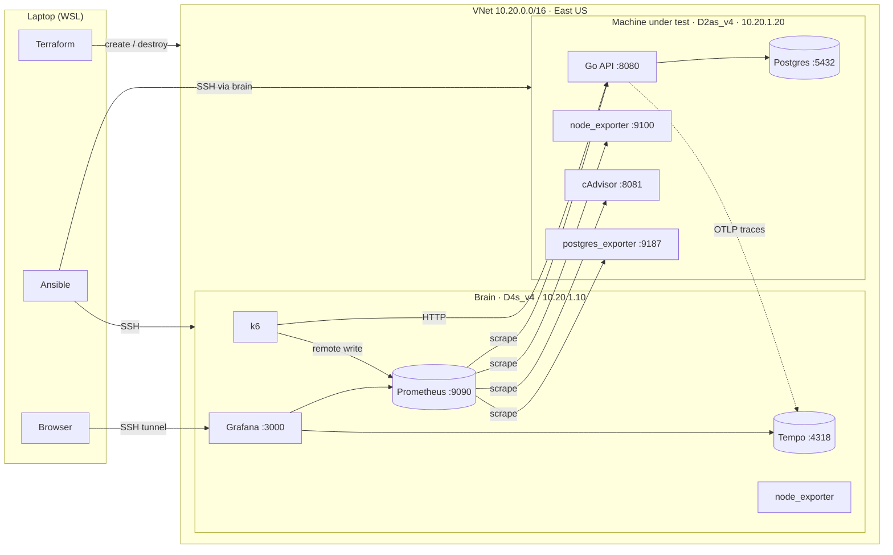
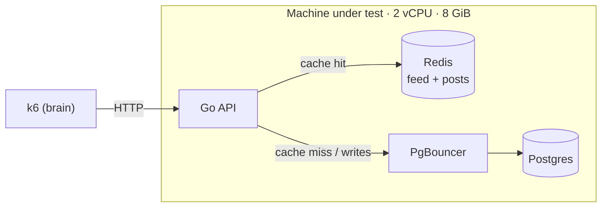
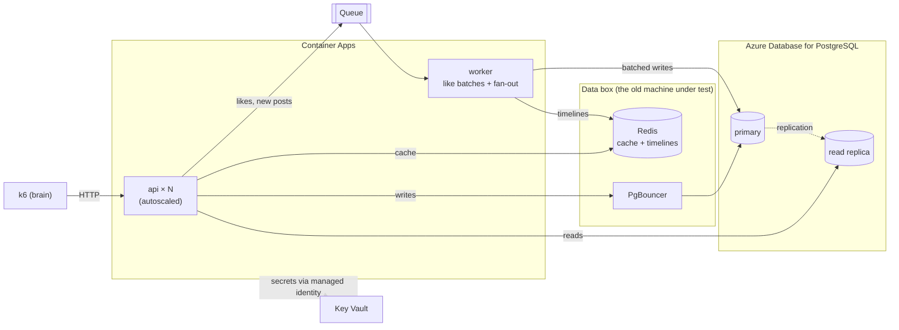
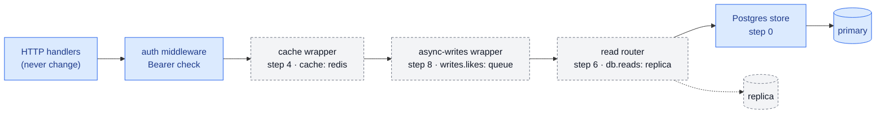
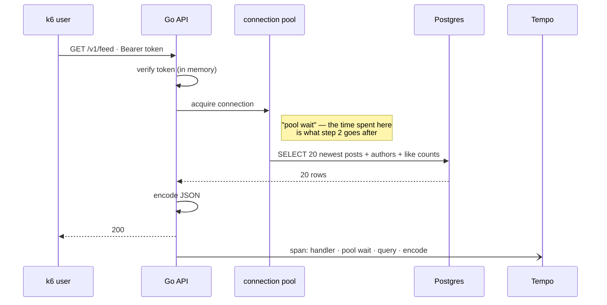
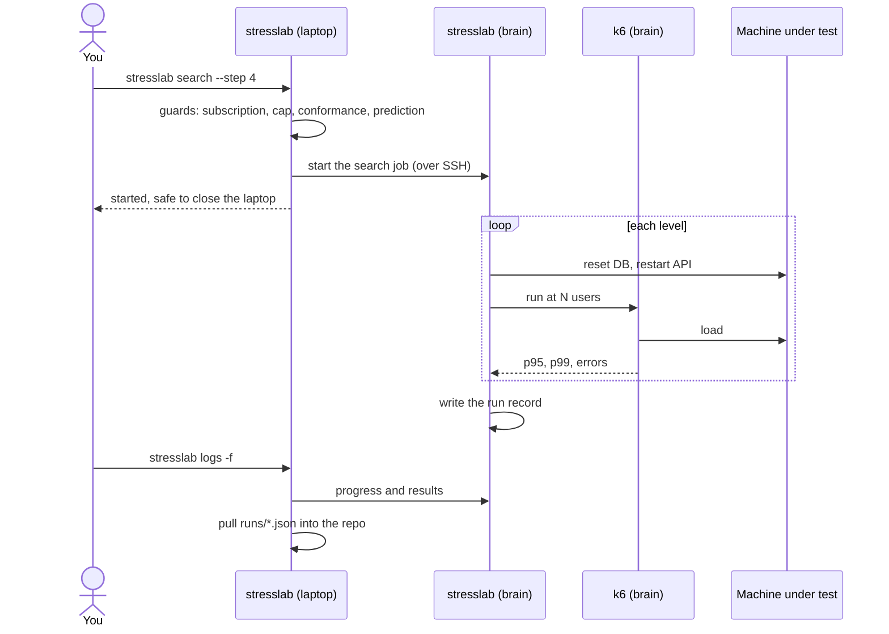

# StressLab — Architecture

> **TL;DR:** Two VMs. The **brain** generates load and watches everything; the **machine under
> test** runs the system. Step 0 is just the Go API and Postgres. Act 1 adds PgBouncer and Redis
> on the same machine. Act 2 moves pieces off it, one at a time, onto Azure managed services —
> managed Postgres, a replica, Container Apps, a queue and a worker — until the machine under
> test is only a data box, or nothing at all.
>
> *What* must be true → [SPEC.md](SPEC.md). *How a run is measured* →
> [METHODOLOGY.md](METHODOLOGY.md). *In what order* → [ROADMAP.md](ROADMAP.md) _(coming)_.
> **Present tense means step 0; later pieces are marked with the step that adds them.**

## What runs where, step by step

The whole inventory, in one table. ➕ added · ➡️ moved · ✖️ removed.

| Step | Change | Machine under test runs | Azure services added | Brain |
|---|---|---|---|---|
| **0** Baseline | — | **api · postgres** · exporters | VNet, 2 VMs, budget alert | k6 · Prometheus · Grafana · Tempo |
| **1** Queries | schema v1 (indexes, stored `like_count`) | same | — | same |
| **2** Pooling | ➕ PgBouncer | api · **pgbouncer** · postgres | — | same |
| **3** Profiling | Go runtime + hot-path changes | same | — | same |
| **4** Cache | ➕ Redis | api · pgbouncer · postgres · **redis** | — | same |
| **5** Managed DB | ➡️ Postgres off the VM | api · pgbouncer · redis | ➕ **Azure Database for PostgreSQL** (Flexible Server), ➕ **Key Vault** | ➕ Azure Monitor data source |
| **6** Replica | ➕ read replica | same | ➕ **read replica** | same |
| **7** Scale out | ➡️ API off the VM, N copies | pgbouncer · redis — now a *data box* | ➕ **Container Registry**, ➕ **Container Apps** _(or VM Scale Sets — SPEC D3)_ | same |
| **8** Async writes | ➕ queue + worker | same | ➕ **queue** _(Storage Queues or Service Bus — SPEC D4)_, ➕ **worker** container | same |
| **9** Fan-out | ➕ follows, per-user timelines | same — Redis now holds timelines | worker also fans out new posts | same |
| **10** Chaos | failures injected mid-run | same | _optional:_ Azure Chaos Studio | same |

**Always on, every step:** node_exporter, cAdvisor (CPU per container), and an exporter for each
data service (postgres, pgbouncer, redis), so the observability cost is identical everywhere
(SPEC F10).

## Step 0: the starting line



- **Each VM is one Docker Compose file** (`deploy/brain/compose.yaml`,
  `deploy/sut/compose.yaml`). Ansible installs Docker, copies the file and the config, and runs
  `docker compose up`.
- **The machine under test uses host networking** — no Docker NAT inside a measured request
  (SPEC, Runtime).
- **Only the brain has a public IP**, and only for SSH from the laptop's IP. The machine under
  test is reached *through* the brain (SSH jump), and has no public address at all.
- **Grafana is never public.** It's reached through an SSH tunnel from the laptop.

## End of Act 1 (step 4)

Everything still on one machine. The question at this point is whether the box has any CPU left
to give.



## End of Act 2 (step 9)

The machine under test has become a data box for PgBouncer and Redis; the API scales on its own;
Postgres is managed, with a replica; likes and fan-out go through a queue.



## Inside the API: how a step plugs in

The SPEC's rule (F2): a step adds behavior by **wrapping** the store, never by editing a handler.
Every wrapper takes the next store in the chain and is switched on in `config.yaml`; with every
switch at its baseline value, the chain is just the Postgres store.



Dashed boxes are off at step 0. Turning one on is the experiment; nothing else in the request
path moves — the same pattern InfraChat used for its retrieval components.

## One request, traced



Every request records **pool wait** and **query time** separately — the evidence METHODOLOGY uses
to say whether the system was waiting *for* the database or *on* it.

## The `stresslab` CLI

One tool drives the whole lab (SPEC F13). It's a thin Go orchestrator: underneath, it shells out
to `terraform`, `ansible-playbook`, `ssh` and `k6` — it adds the **guards** and the **search
logic**, not a reimplementation of those tools.

```
stresslab <command> [target] [--flags]
```

| Group | Command | Does |
|---|---|---|
| **Infra** | `provision brain\|sut` | Terraform apply for that role. **Exits with an error if that role is already running** |
| | `stop brain` | Deallocates: no compute billing, Grafana and Prometheus history kept |
| | `destroy sut\|all` | Terraform destroy |
| | `status` | What's running, for how long, cost so far, quota used (e.g. 6/6 vCPU) |
| **Setup** | `configure brain\|sut` | Ansible: Docker, the Compose stack, config |
| | `deploy --step 4` | Sets that step's switches on the machine under test and restarts the API |
| | `conformance` | The conformance suite — a step can't be benchmarked until it passes |
| **Testing** | `session start` · `session end` | Environment snapshot + control run · collect, write run records, commit |
| | `predict --step 4 "<why>"` | Writes the prediction into the run record **before** any run |
| | `run --step 4 --users 5000 --duration 2m` | One run at one level |
| | `search --step 4` | The full limit search ([METHODOLOGY](METHODOLOGY.md#finding-the-limit)) |
| | `confirm --step 4 --users 5250 --count 3 [--interleave-with 3]` | The confirmations, optionally alternating with the step before |
| **Results** | `compare <run A> <run B>` | Refuses runs whose held-fixed settings differ |
| | `logs -f` | Follows a running search |
| **Handy** | `grafana` | SSH tunnel + opens Grafana in the Windows browser (`wslview`) |
| | `ssh brain\|sut` | A shell on either VM (the machine under test via the brain) |

### Guards — checked before anything is created or run

| Guard | Stops |
|---|---|
| `az account show` must be Azure for Students | deploying into the university's production subscription |
| one running VM per role | a second brain or machine under test quietly doubling the bill (and blowing the 6-vCPU quota) |
| conformance passed for this step's commit | benchmarking a wrong implementation |
| a prediction exists for the step | writing the prediction after seeing the answer |
| the session's control run passed | measuring on a drifted environment |

### Long tests run on the brain

A search plus confirmations can take over an hour — too long to trust a laptop's Wi-Fi or sleep
settings. The same binary runs in two places: on the laptop it checks guards and starts jobs;
on the brain it executes them.



**Why Go and not shell or Python:** the search is real logic (bisection, confirmations, invalid-run
rules, run records), which outgrows shell scripts fast; and one static Go binary can be copied to
the brain with nothing to install — no Python version or virtualenv to manage there.

## Network and ports

| Port | Service | Reachable from |
|---|---|---|
| 22 | SSH (brain) | laptop IP only |
| 22 | SSH (machine under test) | brain only |
| 8080 | Go API — `/v1/*`, `/healthz`, `/metrics`, `/debug/pprof` | brain only |
| 5432 | Postgres | the machine itself (step 0–4) |
| 6432 | PgBouncer _(step 2)_ | the machine itself; Container Apps from step 7 |
| 6379 | Redis _(step 4)_ | the machine itself; Container Apps from step 7 |
| 9100 · 8081 · 9187 · 9127 · 9121 | node_exporter · cAdvisor · postgres / pgbouncer / redis exporters | brain only |
| 9090 · 3000 · 4318 | Prometheus · Grafana · Tempo (OTLP) | the brain itself; Grafana via SSH tunnel |

Network security groups enforce the "reachable from" column; nothing else is open.

## Repository layout

```
StressLab/
├── cmd/
│   ├── api/          the Go API
│   ├── seed/         deterministic dataset → the seed template database
│   └── stresslab/    the CLI: provision, deploy, search, compare … (laptop + brain)
├── internal/
│   ├── api/          handlers + auth middleware
│   ├── store/        Store interface, the Postgres store, and one package per wrapper
│   ├── telemetry/    metrics + tracing setup
│   └── cli/          the CLI's commands, guards and the search job
├── conformance/      the conformance suite (SPEC F6)
├── loadtest/         the k6 script and its options (held fixed)
├── deploy/
│   ├── brain/        compose.yaml + Prometheus, Grafana, Tempo config
│   └── sut/          compose.yaml + Postgres, PgBouncer, Redis config
├── dashboards/       Grafana dashboards as JSON (SPEC F11)
├── infra/            Terraform: network, VMs, budget alert; Act 2 services as they arrive
├── ansible/          inventory, roles, and the session / run playbooks
├── runs/             one JSON file per run — committed, never edited
├── scripts/          laptop setup
└── docs/             SPEC, METHODOLOGY, ARCHITECTURE, ROADMAP, decisions/
```

## Assumptions and risks

| | Risk | What we'll do |
|---|---|---|
| ⚠️ | **Quota:** 6 vCPUs in the region, and step 0 already uses all 6 | Act 2 leans on managed services; whether Container Apps and managed Postgres count against the VM quota gets checked before step 5 (SPEC D5) |
| ⚠️ | **Managed Postgres sizing:** whether a read replica is allowed on the cheapest tier is unverified | Check before step 6; if not, step 6 needs a paid tier and gets priced first |
| ⚠️ | **Act 2 cost** is not yet priced | Every Act 2 service gets a price from the Retail Prices API before its step, like the VMs did |
| ⚠️ | **Docker overhead:** containers add a little CPU even with host networking | Same in every run, so it cancels out; noted in the write-up |
| ⚠️ | **One availability zone:** the brain and the machine under test may land on different hosts with different network latency | The control run catches drift; the run record keeps the environment snapshot |
