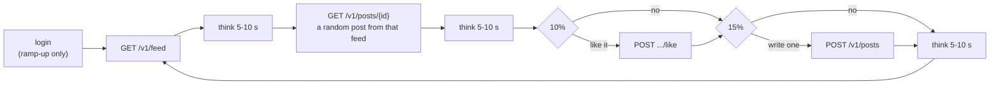
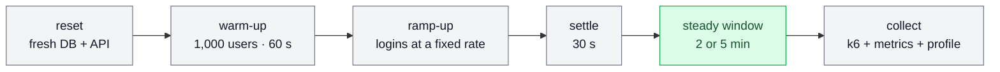
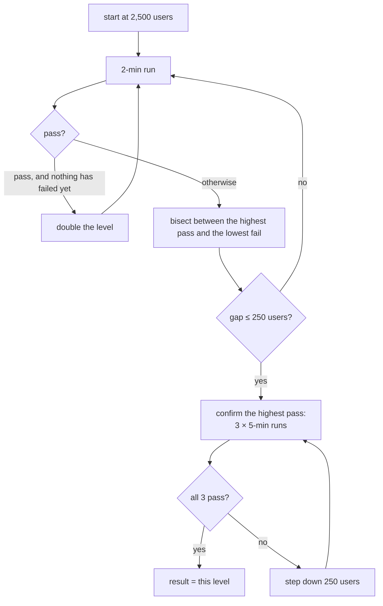
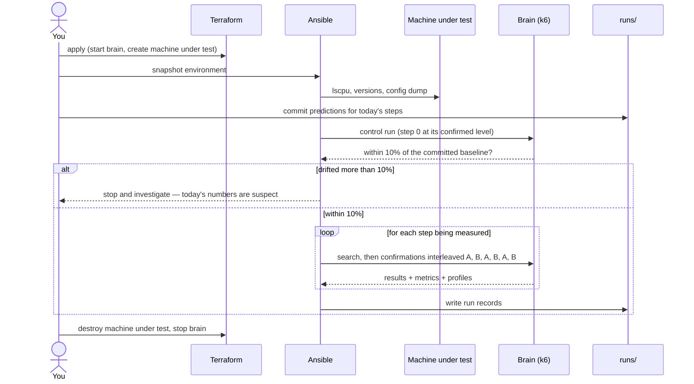

# StressLab — Methodology

> **TL;DR:** How one number gets made. A *run* resets the machine, warms it up, ramps simulated
> users in without measuring, then judges a steady window against fixed thresholds. A *search*
> walks the user count up and down until it finds the highest level that passes, and a
> *confirmation* proves that level three times, interleaved with the thing it's compared against.
> Anything that would make a run measure the wrong thing makes it **invalid**, not failed.
>
> *What* must be true → [SPEC.md](SPEC.md). This doc is *how a measurement is taken*. Changing
> anything here is a held-fixed change: it invalidates comparison with earlier runs.

## Words used here

| Word | Means |
|---|---|
| **User** | One k6 virtual user: its own account, its own seeded randomness, looping through the behavior below |
| **Level** | A number of concurrent users, e.g. 4,000 |
| **Run** | One k6 execution at one level: reset → warm-up → ramp-up → settle → **steady window** |
| **Steady window** | The only part of a run that is measured: 2 min during a search, 5 min during a confirmation |
| **Search** | The sequence of 2-minute runs that finds the highest passing level |
| **Confirmation** | Three 5-minute runs at the level the search found |
| **Session** | One sitting: machines up → control run → runs → results committed → machines down |
| **Control run** | The step-0 baseline re-run at the start of every session, to catch drift |

## The simulated user

Each user is account `user_<n>`, logs in once, then loops forever:

| | Value | Why |
|---|---|---|
| Think time | uniform **5–10 s**, three per loop | Gives **~0.10 requests/s per user** — the same rate as the video, so "users" means the same thing in both |
| Requests per loop | 2 + 0.10 + 0.15 = **2.25** on average | |
| Loop time | ~22.5 s of thinking + response times | 2.25 / 22.5 ≈ **0.10 req/s** |
| Mix of requests | feed 44% · post 44% · create 7% · like 4% | Read-heavy, like a real social app |
| Like | the post just opened; a repeat like is a valid no-op (E3 is idempotent) | |
| Create | a body from a seeded word list, 20–200 characters | Same posts every run |
| Randomness | every choice comes from a per-user seed derived from one run seed | Two runs make the same sequence of decisions |

> **Our own numbers, not the video's.** The video says users "sometimes" like or post; the
> 10% / 15% split and the 5–10 s think time are StressLab's choices, picked to land on the same
> ~0.1 req/s per user. Every result reports **req/s next to users**, so a reader never has to
> trust the conversion.

## One run

1. **Reset.** The database is recreated from a seeded template (`CREATE DATABASE … TEMPLATE
   stresslab_seed`, with statistics already analyzed), and the API container restarts with empty
   caches. Without this, every run's writes pile up and later runs do more work than earlier ones.
2. **Warm-up.** 1,000 users for 60 s, in a separate unmeasured k6 run, so the page cache and the
   Go runtime are in the same warm state before every measurement.
3. **Ramp-up.** Users start at a **fixed login rate** (set in step 0 from the measured bcrypt
   cost, so login CPU stays well below saturation). Higher levels simply ramp for longer.
4. **Settle.** 30 s at full level with nothing logging in.
5. **Steady window.** The only measured part. Requests are tagged `phase=steady`, and every
   threshold is evaluated on that tag only.
6. **Collect.** k6's summary, Prometheus metrics for the window, the top queries from
   `pg_stat_statements`, and a **30-second Go CPU profile** taken mid-window.

### Pass or fail

A run **passes** when, over the steady window:

| Check | Limit |
|---|---|
| p95 latency | < 500 ms |
| p99 latency | < 1 s |
| Errors | < 1% — any non-2xx, timeout, connection error, or a 2xx whose body fails its shape check |

## Finding the limit

- **Granularity is 250 users.** Differences smaller than that aren't claimed.
- **Why confirm for 5 minutes:** the video showed a level can pass for 2 minutes and fail for 5
  (Node cleared 3,750 users on the short test and only held 3,250 on the long one). Slow leaks —
  a filling pool, a growing queue, GC pressure — need time to show.
- **Why three times:** one run is an anecdote. The result is the highest level where **all three**
  pass, reported as **median [min–max]** for req/s, p95 and p99.
- **Raw ceiling (once per step).** Separately from the search, a constant-arrival-rate test hits
  `GET /v1/feed` alone until it breaks. It answers a different question — "how fast can it go?"
  vs "how many users can it hold?" — and is reported beside the result, never instead of it.

## A session

- **Predictions are committed before the runs.** Git history then proves the prediction wasn't
  written after seeing the answer. A wrong prediction is kept, not edited — it's often the most
  interesting line in the write-up.
- **Control run first.** The video saw the same stack score ~8% lower at the end of the day than
  at the start. The control run turns that into a check: off by more than 10% → the session's
  numbers aren't trusted.
- **Interleave A and B.** When a step is compared against the one before it, their confirmations
  alternate, so time-of-day drift lands on both equally instead of on whichever ran second.

## When a run is invalid

An **invalid** run measured something other than the system. It's kept in `runs/` with
`"valid": false` and the reason, but it never counts as a pass or a fail.

| The run is invalid if | Because |
|---|---|
| k6 uses more than 80% of the brain's CPU, or drops iterations | the load generator became the bottleneck |
| the session's control run drifted more than 10% | the environment changed, not the code |
| the machine under test's CPU model differs from the baseline's | it landed on different hardware (Azure doesn't pin the physical host) |
| the steady window had logins in it | the login storm leaked into the measurement |
| any error came from the brain (file descriptors, ports, memory) | a load-generator failure, not a system one |

## Finding what broke

A result without a reason is half a result. At the limit, every run record names **what
saturated**, from evidence, not a guess:

| Evidence | Tells you |
|---|---|
| CPU per container (API vs Postgres vs Redis) | which process ran out first |
| Pool wait time vs query time | waiting *for* the database vs waiting *on* it |
| Top 5 queries by total time (`pg_stat_statements`) | which query to go after next |
| Go CPU profile (flame graph) | where the API's own time goes |
| Which threshold failed first at the next level up | latency creep (p95), tail spikes (p99), or hard failures (errors) |

That finding becomes the next step's prediction.

## Reading the results honestly

- **Within 10% is the same tier.** Treat a smaller difference as noise unless the interleaved
  confirmations show it consistently.
- **Not like-for-like gets a label.** Postgres on the same VM vs across the network (step 5), one
  API instance vs several (step 7): the comparison is still useful, but it says so everywhere
  it's shown.
- **Negative results get a row.** A step that didn't help is a finding, not a failure.

## What we took from the video, and what we changed

The method stands on Arjay's experiment
([I Tested 8 Programming Languages on a $12 Server](https://www.youtube.com/watch?v=sQXFhh_PiG4)).
His practices, adapted to a project that holds the language still and changes the system:

| His practice | Ours |
|---|---|
| Same host for every implementation | Same VM size, region and image per step — plus `lscpu` on every run, because the cloud can move us to different hardware |
| Same behavior: endpoints, JSON, auth, schema, raw SQL, no caching, one query per endpoint | Same, with the store behind one interface — and caching becomes a *step*, not a rule |
| Defaults, not hand-tuning | Defaults at step 0; every tuning is its own step with its own number |
| A correctness suite before benchmarking | Our own conformance suite (SPEC F6), including the consistency contract for the steps that trade it |
| Same seeded dataset | Same, **and reset before every run** so writes don't pile up |
| Realistic users with think time | Same idea, our own mix (10% like, 15% create) and think time, tuned to the same ~0.1 req/s |
| Warm-up before measuring | Warm-up **and** an unmeasured ramp-up, because our login is deliberately expensive |
| Raw throughput test on the feed | Same, once per step, reported beside the result |
| Binary search, 2-min steps, 5-min confirmation | Same shape, 250-user granularity |
| p95 / p99 / error thresholds | The same three limits, judged on the steady window only |
| Three runs at the peak | All three must pass; reported as median [min–max] |
| Investigate anomalies before accepting them | Every result names its bottleneck from evidence |
| Reported the CPU split | CPU per container, plus pool wait and query time |
| Noticed drift across the day | A control run per session, and interleaved comparisons |
| — | **New:** predictions committed before runs; invalid-run rules; a profile captured at the limit |
