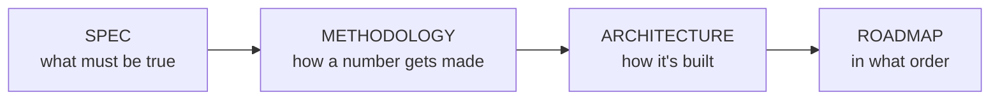

# StressLab — Docs

> **TL;DR:** Four docs, split by the question they answer. Read them in this order: **SPEC →
> METHODOLOGY → ARCHITECTURE → ROADMAP.** If you only read one, read the SPEC.

| Doc | Answers |
|---|---|
| [SPEC.md](SPEC.md) | **What** must be true — the question, the ladder and its switches, the API, auth, requirements, the held-fixed list, the run record, SLOs, logging, infrastructure, what's decided and what's open |
| [METHODOLOGY.md](METHODOLOGY.md) | **How a number gets made** — the simulated user, one run's phases, the limit search, beyond the limit, a session, invalid runs, finding what broke |
| [ARCHITECTURE.md](ARCHITECTURE.md) | **How it's built** — what runs where at every step, the diagrams, the store wrapper chain, the `stresslab` CLI, ports, repo layout, risks |
| [ROADMAP.md](ROADMAP.md) | **In what order** — build the lab, then climb the ladder; where you can stop; the per-step definition of done; status |

## The one-paragraph version

One Go API and one Postgres run on one small Azure VM; a second VM — the brain — runs k6 and
the full Grafana stack. A simulated user browses, likes and posts at ~0.1 requests/second. A
step changes exactly **one** config switch; a search finds the highest number of users that
still meets the SLOs, three confirmations prove it, and an overload sweep shows what happens
past it. Every run is a committed JSON file in `runs/`, and the README's results are generated
from those files. Act 1 squeezes the single machine; Act 2 scales out onto Azure managed services
and Kafka; step 10 pushes everything past its limit.

## Conventions

- **SPEC is the contract.** If the code and the SPEC disagree, one of them is a bug — say which.
- **Present tense means it exists or is decided.** Anything later is marked with its step.
- **Decisions live in the SPEC's *Decided* and *Open decisions* tables** — there are no separate
  decision records. What each step changed and found lives in its run record's `notes`.
- **Diagrams are Mermaid**, inline, so they render on GitHub. Every diagram is checked to render
  before it's committed.
- **External facts carry a date.** Prices, quotas, VM specs and service limits say when and where
  they were checked.
- **Docs change with the code.** A change that alters behavior updates the doc that describes it
  in the same commit.
