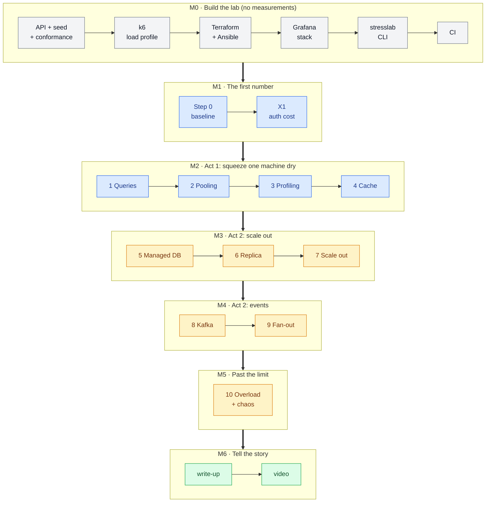
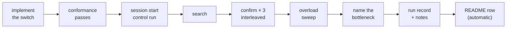

# StressLab — Roadmap

> **TL;DR:** First build the lab — the API, the load, the machines, the dashboards, the CLI — and
> measure nothing. Then climb the ladder one step at a time, each step going through the same
> loop and ending in a committed run and a README row. **Every milestone is a stopping point
> that still leaves a finished project.** The last deliverable is a write-up and a video.
>
> *What* must be true → [SPEC.md](SPEC.md). *How a run is measured* →
> [METHODOLOGY.md](METHODOLOGY.md). *How it's built* → [ARCHITECTURE.md](ARCHITECTURE.md).

## The whole thing

## Where you can stop

Every milestone leaves something finished and showable. The README always reflects exactly how
far the project got — because it's generated from `runs/` (SPEC F14).

| Stop after | What exists | What it shows a reviewer |
|---|---|---|
| **M1** | The lab + one honest baseline | Infrastructure as code, a CLI, full observability, a rigorous method — and a first real number |
| **M2** | Act 1 complete: 5 measured rows | **The core story:** how far one machine goes and what each fix bought. A solid CV project on its own |
| **M3** | + managed Postgres, a replica, scale-out | Azure managed services, and when scaling out actually helps |
| **M4** | + Kafka on Event Hubs | Event-driven design, partitions, consumer lag, the celebrity problem |
| **M5** | + the overload curve | What happens past the limit, and how load shedding saves goodput |
| **M6** | + write-up and video | The whole thing told in 3 minutes |

## M0 · Build the lab

No measurements yet — the goal is a lab that works end to end. Built **one item per step**,
each one run and shown before the next.

| # | Item | Done when |
|---|---|---|
| 0.1 | **Repo skeleton** — Go module, folders from [ARCHITECTURE](ARCHITECTURE.md#repository-layout), `AGENTS.md` | `go build ./...` passes |
| 0.2 | **Go API, step-0 path** — E0–E6, auth, the `Store` interface, the Postgres store, `/metrics` | It answers on the laptop against a local Postgres |
| 0.3 | **Seeder** — the deterministic dataset into a template database | Same seed twice → identical row checksums |
| 0.4 | **Conformance suite** (SPEC F6) | Passes against the step-0 API; fails when a response is broken on purpose |
| 0.5 | **k6 script** — the simulated user from METHODOLOGY, steady-window tagging | A 1-minute smoke run on the laptop; ~0.1 req/s per user |
| 0.6 | **Docker Compose** for both roles (`deploy/sut`, `deploy/brain`) | Both stacks come up on the laptop |
| 0.7 | **Terraform** — network, both VMs, NSGs, budget alert, nightly auto-shutdown | `apply` and `destroy` both work; budget alert visible in the portal |
| 0.8 | **Ansible** — Docker, compose, config, DB reset | A fresh VM is configured with one command |
| 0.9 | **Observability** — Prometheus, Loki, Tempo, Pyroscope, Alloy, dashboards as code | Every dashboard shows live data during a smoke run; trace → logs → profile links work |
| 0.10 | **`stresslab` CLI** — infra and setup commands, then `run`, `search`, `confirm`, `compare`, `logs` | `stresslab search --step 0` completes a short test search on Azure |
| 0.11 | **CI** — build, test, lint, and the results-publishing workflow (SPEC F14) | A fake run file in a branch regenerates the README table |

**Prerequisite on the laptop:** Docker inside WSL (enable Docker Desktop's WSL integration).

## Every step goes through the same loop

From step 0 on, a step is **done** only when it has gone all the way round:

**Definition of done for a step:**

- [ ] The switch is implemented behind config, baseline value unchanged
- [ ] Conformance passes, including the consistency contract if the step trades consistency
- [ ] Limit found and confirmed 3 times, interleaved with the step before
- [ ] Overload sweep run (from the step's limit)
- [ ] The bottleneck at the limit is named, from evidence
- [ ] Run records committed; any invalid runs kept with their reason
- [ ] The run record's `notes` say what changed, the number, and what broke next — including when it didn't help
- [ ] The README row appears (generated, never typed)
- [ ] A Grafana screenshot or GIF of the step's limit is saved for the write-up

## M1 · The first number

| | Delivers | Notes |
|---|---|---|
| **Step 0** | The baseline limit, its bottleneck, its overload curve — and the **control run** every later session checks against | Everything at defaults (SPEC N1) |
| **X1** | Basic + bcrypt on every request vs tokens | Cheap and early: it only needs step 0's code |

## M2 · Act 1 — squeeze one machine dry

Steps **1 → 4** in order (SPEC ladder): queries, pooling, profiling, cache. All on the same
machine, no new Azure services, ~$1.15 per 4-hour session.

**Gate to Act 2:** the numbers show the machine is out of road — the last steps bought little,
and the bottleneck is the box itself.

## M3 · Act 2 — scale out

**Before step 5:** settle SPEC D5 (capacity beyond the 6-vCPU quota) and price managed Postgres,
the replica, the container registry and Container Apps from the Retail Prices API.

Steps **5 → 7**: managed Postgres, a read replica, then the API on Container Apps (or VM Scale
Sets — SPEC D3).

## M4 · Act 2 — events

**Before step 8:** confirm how Event Hubs bills its Kafka endpoint.

Steps **8 → 9**: likes as Kafka events with a batching consumer, then follows and fan-out as a
second consumer. **X3** (self-hosted Kafka vs Event Hubs) is optional here.

## M5 · Past the limit

**Step 10**: the overload sweep with load shedding off vs on — the goodput chart — then failures
injected mid-run: kill the database, kill an API instance, stall a consumer.

## M6 · Tell the story

| Deliverable | What it is |
|---|---|
| **README** | Leads with the results table and the two best charts (the ladder and the overload curve) |
| **Write-up** | One page per act: what broke, what fixed it, what it cost — the honest negatives included |
| **Video** | 2–3 minutes: Grafana while the system breaks, the fix, the next break; ends on load shedding holding the line |

## Side experiments

Optional, and never in the way of the ladder:

| | When | Question |
|---|---|---|
| **X1** | M1 | What does checking a password on every request cost? |
| **X2** | after M2 | What if we'd changed the database (Cosmos DB) instead of tuning this one? |
| **X3** | M4 | What does managed Kafka cost and buy over self-hosted? |

## Status

| Milestone | Status |
|---|---|
| Docs: README, SPEC, METHODOLOGY, ARCHITECTURE, ROADMAP | ✅ |
| Docs: docs/README.md, AGENTS.md, CLAUDE.md | ✅ |
| M0 · Build the lab | not started |
| M1 → M6 | not started |
