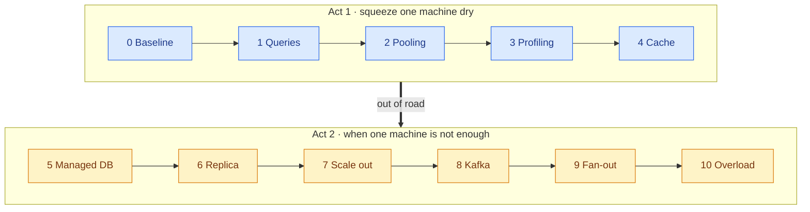
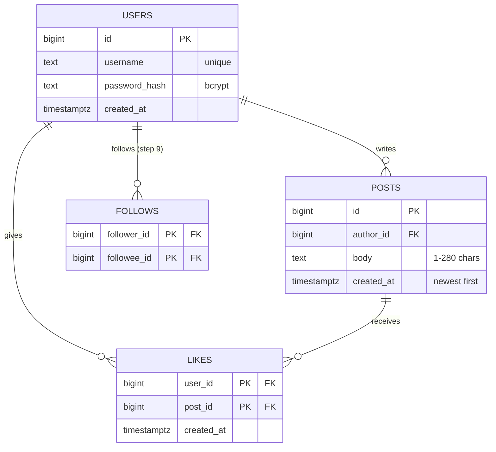
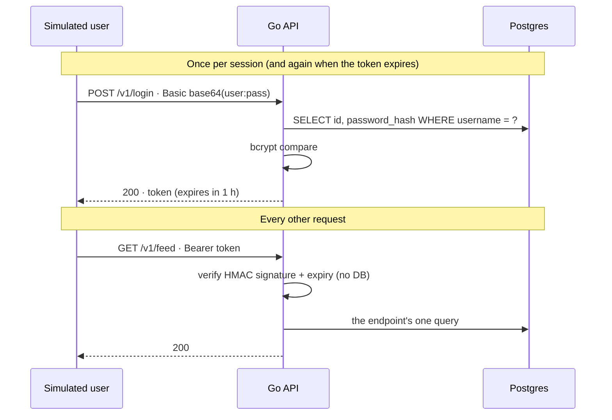
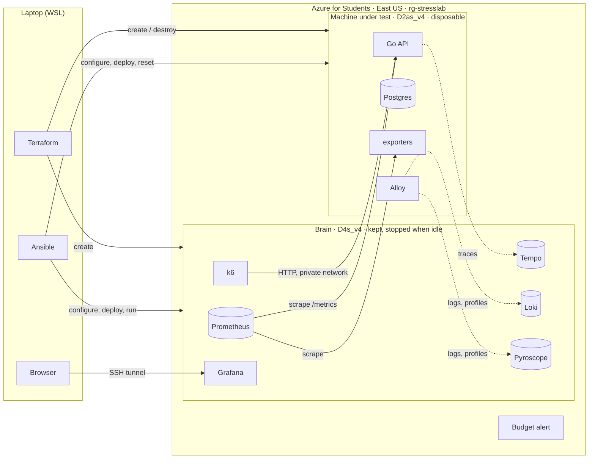

# StressLab — Specification

> **TL;DR:** One Go API and one Postgres on one Azure VM, hit by the same simulated users every
> time. Change **one thing per step**, find the new limit, record what broke next. Act 1 squeezes
> the single machine dry; Act 2 scales out only when the numbers say so.
>
> This is the **contract**: what must be true, the shapes the system speaks, and its bounds.
> *How a run is measured* → [METHODOLOGY.md](METHODOLOGY.md). *How it's built* →
> [ARCHITECTURE.md](ARCHITECTURE.md). *In what order* → [ROADMAP.md](ROADMAP.md).
> *Why* → [decisions/](decisions/) _(coming)_.
>
> If the code and this doc disagree, one of them is a bug — say which, don't silently drift.
> **Present tense means it exists or is decided; anything later is marked with its step.**

## The question

> **How many concurrent users can one small machine serve — and what does each measured change
> buy, until one machine is genuinely out of road?**

Every result is reported as **max passing users + what failed next + cost per hour**. "What
failed next" is the point: each step exists to move the bottleneck, and the next step goes after
wherever it moved.

## The ladder

The order and the reasoning live in [ROADMAP.md](ROADMAP.md); this table fixes **what each step
is allowed to vary** and the config switch that varies it. Every switch has a "baseline" value,
and a step changes exactly one.



| Step | Varies | Switch | Baseline value |
|---|---|---|---|
| **0** | nothing — this is the reference | — | — |
| **1** | the SQL, indexes, a stored `like_count` | `schema` version | `v0` |
| **2** | how connections reach Postgres | `db.pooler` / `db.pool_size` | `none` / `10` |
| **3** | Go runtime and code hot paths | `GOGC`, `GOMEMLIMIT`, code commit | Go defaults |
| **4** | a cache in front of the feed and posts | `cache` | `none` |
| **5** | where Postgres runs | `db.host` | `local` (same VM) |
| **6** | where reads go | `db.reads` | `primary` |
| **7** | how many API instances | `api.instances` | `1` |
| **8** | how likes are written — straight to Postgres, or as Kafka events a consumer batches | `writes.likes` | `sync` |
| **9** | the feed model (adds follows); fan-out on write is a second Kafka consumer | `feed.mode` | `global` |
| **10** | load past the limit, with and without **load shedding**; then failures mid-run | `api.shedding` · `chaos` | `off` · `none` |

**Side experiments** — measured once, not part of the ladder's chain:

| | Varies | Question |
|---|---|---|
| **X1** | `auth.mode`: `token` → `basic-every-request` | What does checking a password hash on every request cost? (Why tokens exist, in one number.) |
| **X2** | `db.engine`: Postgres → Cosmos DB | What if we'd changed the database instead of tuning this one? _(optional)_ |
| **X3** | `events.broker`: Event Hubs → self-hosted Kafka | What does *managed* Kafka cost and buy? _(optional)_ |

## The application

A tiny Twitter-style API — the same shape as the video this project started from.



This is the **logical** model. A step may change the physical one (a stored `like_count`, a
Redis timeline per user) as long as the API's responses still pass the conformance suite (F6).

### Endpoints

| ID | Method + path | Does | Returns |
|---|---|---|---|
| **E0** | `POST /v1/login` | Checks `Authorization: Basic base64(user:pass)` against the stored hash | `200` + `{"token": "...", "expires_at": "..."}`, or `401` |
| **E1** | `GET /v1/feed` | The 20 newest posts, newest first | `200` + `{"posts": [Post × 20]}` |
| **E2** | `GET /v1/posts/{id}` | One post | `200` + `Post`, or `404` |
| **E3** | `POST /v1/posts/{id}/like` | The caller likes the post. **Idempotent** — liking twice doesn't double-count and isn't an error | `204`, or `404` |
| **E4** | `POST /v1/posts` | Create a post: `{"body": "..."}`, 1–280 characters | `201` + `Post`, or `400` |
| **E5** | `GET /healthz` | Liveness plus a store ping. No auth | `200` or `503` |
| **E6** | `GET /metrics` | Prometheus metrics. Private network only, no auth | `200` |
| **E7** | `POST /v1/users/{id}/follow` | _(step 9)_ The caller follows a user. Idempotent | `204`, or `404` |
| **E8** | `GET /v1/timeline` | _(step 9)_ The 20 newest posts from people the caller follows | `200` + `{"posts": [Post × ≤20]}` |

```json
// Post — the one response shape
{
  "id": 123,
  "author": { "id": 42, "username": "user_42" },
  "body": "hello",
  "like_count": 17,
  "created_at": "2026-10-03T12:00:00Z"
}
```

- **Errors** are `{"error": "<message>"}`; the status code does the real work.
- E5 and E6 are **never** part of the load profile.

### Authentication



- **Login (E0)** is real: passwords are stored as **bcrypt** hashes at a fixed cost, and the
  login checks the hash. This is the only place a password is ever checked.
- **Every `/v1/*` request except E0** carries `Authorization: Bearer <token>`. Missing,
  malformed, wrongly signed or expired → `401`. There is no way around the check.
- **The token** is an HMAC-SHA256-signed `{user_id, expires_at}`, verified in memory with a key
  from an environment variable. **Checking it never touches the store** — so every endpoint
  stays exactly one store operation (F3).
- **Expiry is 1 hour** — longer than any run, so no token expires mid-measurement. A simulated
  user that gets `401` still logs in again, so expiry is handled correctly, just never hit.
- **Logins happen during an unmeasured ramp-up.** bcrypt is slow on purpose (tens of ms of CPU
  per login); thousands of users logging in at once would saturate the machine and the run would
  measure a login storm, not the system. Users start gradually and the thresholds are judged only
  on the steady period after. The login cost is measured on purpose in side experiment **X1**.
- Seeded users have known passwords (`user_<id>` / a seed-derived password) so k6 can log in.
  They are synthetic test accounts, not secrets. **The signing key is a secret.**
- **An unknown username costs the same as a wrong password.** Login runs a dummy bcrypt compare
  when the user doesn't exist, so the response time never reveals which usernames are real
  (no user enumeration by timing). Both return the same `401` body.

### Consistency contract

The baseline is **strongly consistent**: a like or a post is visible to the next read. Steps that
trade consistency for speed must state the trade, and the conformance suite checks it:

| Step | Allowed staleness |
|---|---|
| 4 · cache | feed and `like_count` up to the cache TTL, set by step 4's ADR |
| 6 · replica | reads up to the replica lag, measured and reported per run |
| 8 · likes via Kafka | `like_count` up to the consumer lag plus the batch interval, measured per run |
| 9 · fan-out on write | a new post reaches followers' timelines within the fan-out delay |

Everywhere else, and for **all** responses once the system is quiet, the responses must match
the baseline exactly.

## Functional requirements

| ID | Requirement |
|---|---|
| **F1** | **Serve E0–E6** (E7–E8 from step 9) with the shapes above, from one Go binary (`cmd/api`). |
| **F2** | **One `Store` interface.** Handlers never import a backend. A step adds behavior by **wrapping** the store (a cache, a replica router, an async writer) behind a config switch — never by editing a handler. With every switch at its baseline value, the code path is the baseline's. |
| **F3** | **One store operation per request** for E1–E4, as in the video. No auth lookups, no read-before-write, no N+1. E0 is one lookup plus the bcrypt compare. |
| **F4** | **Deterministic seed** (`cmd/seed`): 50,000 users, 500,000 posts, ~2,000,000 likes, from a fixed seed value. Same seed → same rows → same responses. Step 9 adds a deterministic follow graph with a few deliberate "celebrities". |
| **F5** | **One fixed load profile** (k6), and a **limit search** that finds the max users that pass the thresholds — defined in [METHODOLOGY.md](METHODOLOGY.md). |
| **F6** | **Conformance before benchmark.** Every step passes the same suite before it's load-tested: every endpoint, status code, auth rule and error case, the consistency contract, and **byte-identical** E1/E2 bodies against the step-0 baseline on the same seed (once quiet) — plus a timing check that an unknown username and a wrong password take the same time to reject. A step that fails is not benchmarked. |
| **F7** | **Every run is recorded** as one committed JSON file in `runs/` (see *Run record*). |
| **F8** | **`stresslab compare`** compares two runs and **refuses** when their held-fixed settings differ, printing what differs. |
| **F9** | **Infrastructure is code.** Terraform creates and destroys every Azure resource; Ansible configures every machine and drives every run. Nothing is clicked together in the portal. |
| **F10** | **Observability is always on** — metrics, logs, traces and profiles, with the same exporters, collectors, scrape interval, trace sample rate and profiling rate in every run, including the baseline, so their cost is identical everywhere. |
| **F11** | **Dashboards are code.** Every Grafana dashboard is a committed JSON file, provisioned by Ansible. A rebuilt brain VM gets identical dashboards. |
| **F12** | **Every cost is stated**: each run records the hourly price of everything it used, with the date and the source it was checked against. |
| **F13** | **One CLI, `stresslab`, drives everything** — provisioning, configuration, deploys, conformance, runs, searches, comparisons. It **refuses to provision a role that's already running** (at most one brain and one machine under test), refuses to touch any subscription but Azure for Students, and runs long searches **on the brain**, so a laptop disconnect never kills a test. Commands → [ARCHITECTURE.md](ARCHITECTURE.md#the-stresslab-cli). |
| **F14** | **Results publish themselves.** A GitHub Actions workflow regenerates the README's results table and charts from `runs/*.json` on every push that changes `runs/`. The README can never show a number that isn't in a committed run. |
| **F15** | **Overload is measured, not just the limit.** Every step that reaches it gets an overload sweep (offered load past the limit), and step 10 compares it with load shedding off and on — [METHODOLOGY.md](METHODOLOGY.md#beyond-the-limit). |

## Non-functional requirements

| ID | Requirement |
|---|---|
| **N1** | **Defaults, then experiments.** Step 0 runs everything at its defaults with the obvious indexes. Every change from a default is a step, with an ADR and a number. |
| **N2** | **Budget:** Azure for Students, $100 for 12 months. A budget alert exists before the first resource. Machines run only during sessions. |
| **N3** | **Reproducible:** from a clean subscription, `terraform apply` plus one Ansible playbook reproduces any committed run's setup. |
| **N4** | **Honest comparisons:** anything not like-for-like (e.g. a database on the same VM vs across the network) is labeled wherever it's shown. Negative results get a row too. |

## Load profile (summary)

Full definition, think times and the search procedure → [METHODOLOGY.md](METHODOLOGY.md).

- **One simulated user = one k6 virtual user** with its own account. Users start gradually over an
  **unmeasured ramp-up**, each logging in once; then every user loops:
  open the feed → think 5–10 s → open a post from that feed → think → **10%: like it** →
  **15%: create a post** → think → repeat.
- That works out to roughly **0.1 requests/second per user**, as in the video — so the results
  can sit next to his.
- **Unhappy paths are part of the load**, at small fixed rates: posts that don't exist (`404`),
  wrong passwords and unknown users at login (`401`), garbage tokens (`401`), invalid post
  bodies (`400`). Each request declares the status it expects.
- **Every random choice is seeded**, so two runs make the same sequence of decisions.
- **A level passes** only if **p95 < 500 ms, p99 < 1 s and errors < 1%** over the steady period
  (ramp-up excluded), first over a 2-minute search step and then over a 5-minute confirmation.

## The held-fixed list

Changing any of these **invalidates comparison with earlier runs**. Every run record stores
them; `stresslab compare` refuses runs where they differ.

| Held fixed | Value |
|---|---|
| Dataset | seed value, row counts (F4); reset before every run |
| Load profile | k6 script hash, think times (5–10 s), the 15% / 10% mix, user seed |
| Thresholds | p95 < 500 ms · p99 < 1 s · errors < 1% |
| Search procedure | start point, step sizes, 2-min search, 5-min confirm, 3 confirmations |
| Auth | bcrypt cost, token expiry (1 h), ramp-up length |
| Runtime | Docker Compose on both VMs; **host networking** on the machine under test; image digests pinned |
| Machine under test | `Standard_D2as_v4`, East US, OS image version |
| Brain (load generator) | `Standard_D4s_v4`, same region, k6 version |
| Observability | exporters, collectors, scrape interval, trace sample rate, profiling rate, **logging policy** |
| Go + Postgres versions | pinned, recorded per run |

**A step varies exactly one switch** from the ladder table, and its run record names it.

## Run record

One JSON file per run in `runs/`, named `<date>-s<step>-<variant>.json`:

| Field | Holds |
|---|---|
| `fixed` | every held-fixed value above |
| `step` | the ladder step, the switch it varied, the value, and the baseline run it compares against |
| `result` | max passing users (the highest level where **all 3 confirmations pass**); req/s, latencies and error rate as **median [min–max]** over the 3; p50/p95/p99; error rate; status-code counts; and **which threshold failed** at the next level up |
| `search` | every level tried: users, pass/fail, the numbers |
| `bottleneck` | CPU per process (API, Postgres, Redis…), pool wait time, top queries — what was saturated at the limit |
| `environment` | `lscpu` CPU model and clock, kernel, Go, Postgres and k6 versions, git commit, full Postgres config |
| `control` | that session's control run (the step-0 baseline, re-run), to catch drift |
| `cost` | hourly price of every resource used, date checked, source URL |

## Infrastructure



| | |
|---|---|
| **Subscription** | Azure for Students, `2b812a74-f9f4-4848-b71d-eb7898148ce3` — **pinned in the Terraform provider**, never taken from the CLI default |
| **Region** | East US |
| **Quota** | 6 vCPUs in the region (checked 2026-10-03). Brain 4 + machine under test 2 = **6/6**. Newer AMD D-series (v5, v6) have no quota on this subscription |
| **Machine under test** | `Standard_D2as_v4` — 2 vCPU, 8 GiB, AMD, non-burstable — $0.096/h |
| **Brain** | `Standard_D4s_v4` — 4 vCPU, 16 GiB, Intel, non-burstable — $0.192/h |
| **Kafka** _(step 8)_ | **Azure Event Hubs, Standard tier**, Kafka endpoint (Basic has none). Standard throughput unit $0.03/h; the price list also shows a "Standard Kafka Endpoint" meter at $0.09/h — how it's billed gets confirmed before step 8 |
| **Network** | One virtual network, private traffic only between the VMs. The only public entry is SSH to the brain, locked to the laptop's IP |
| **Runtime** | Everything runs in **Docker Compose** from step 0 — API, Postgres, exporters and Grafana Alloy (log and profile collector) on the machine under test; k6, Prometheus, Loki, Tempo, Pyroscope and Grafana on the brain. Ansible installs Docker and runs `docker compose up`. The machine under test uses **host networking**, so Docker's NAT layer never sits inside a measured request |
| **Prices** | Linux pay-as-you-go, East US, from the Azure Retail Prices API on 2026-10-03 |

Act 2 may need resources beyond the 6-vCPU quota (a second VM for the database or a replica).
That's a decision for when Act 2 starts — see the open decisions.

## Observability

| Dashboard | Shows | Fed by |
|---|---|---|
| **Machine** | CPU per core, RAM, disk I/O, network | node_exporter |
| **Backend** | requests in flight, per-endpoint latency, pool wait, Go runtime (goroutines, GC pauses, heap) | the API's `/metrics` |
| **Database** | connections, transactions/s, cache hit ratio, locks, slowest queries | postgres_exporter + `pg_stat_statements` |
| **Traffic** | virtual users, req/s, p50/p95/p99, status codes, failures — per endpoint | k6 → Prometheus |
| **Traces** | one request's waterfall: handler → pool → query | OpenTelemetry → Tempo |
| **Logs** | every container's logs, searchable, linked from traces by trace ID | Grafana Alloy → Loki |
| **Profiles** | flame graphs over time — what the API's CPU was doing at any moment of a run | Grafana Alloy → Pyroscope |
| **SLOs** | the three objectives, the error budget left, and its burn rate during a run | Prometheus |
| **Kafka** _(step 8+)_ | events/s per topic, **consumer lag per partition** | Event Hubs metrics via Azure Monitor |
| **Run overview** | one run on one screen: verdict, the limit, what saturated | all of the above |

**Everything is linked:** from a slow request's trace, one click to its logs and to the flame
graph from that moment — metrics, logs, traces and profiles in one place.

### Logging

Every log line costs CPU on the machine being measured — building the JSON, Docker writing it,
Alloy shipping it — so **what gets logged is a fixed policy**, the same in every run:

| Logged | Why |
|---|---|
| **Every non-2xx response** | Errors are what logs are for |
| **Every request slower than 500 ms** (the latency SLO) | The slow ones are the interesting ones |
| **1% of the rest** — the *same* requests that get traced | A sample of "normal", each with a trace to click into |

- **Structured JSON on stdout** via Go's `log/slog`: time, level, method, route, status,
  duration, user ID and **`trace_id`** — the field that links a log line to its trace. The API
  never knows Loki exists; Docker captures stdout and Alloy ships it.
- **Docker's log files are size-capped**, so a long search can't fill the disk.
- **Log everything vs this policy** is an optional side experiment — what full logging costs.

**Grafana is for watching; `runs/` is the record.** No number reaches the README from a
dashboard — only from a committed run file.

## Service level objectives

The pass/fail thresholds are framed as **SLOs** — the way an SRE team would write them:

| SLO | Objective | Error budget (per steady window) |
|---|---|---|
| **Availability** | 99% of requests get the response they expected | 1% may fail |
| **Latency** | 95% of requests complete in < 500 ms | 5% may be slower |
| **Tail latency** | 99% of requests complete in < 1 s | 1% may be slower |

**What counts as a failure:** every request declares the status it expects. A `404` for a post
that doesn't exist is a **success** — the server did its job. A `404` for a post that *does*
exist, a `401` for a valid token, any `5xx`, a timeout or a connection error is a **failure**.
Deliberate unhappy paths therefore never spend the error budget, but real bugs still do. A `429`
from the load shedder (step 10) **counts as a failure** — that user wasn't served — which is why
step 10 is judged on goodput.

A level passes when **no budget is exhausted**. During a run, Grafana shows each budget burning
down, and a **burn-rate alert** fires when one is being spent fast enough to run out before the
window ends — the same alerting pattern production teams use.

## Configuration

- **`config.yaml`** — how the API runs: every ladder switch, pool size, listen address. Every
  switch defaults to its baseline value.
- **Environment variables only** for secrets: database password, token signing key.
- **Terraform variables** — what Azure builds. **Ansible inventory and vars** — where things run
  and which step a run is.

## Out of scope

- **Comparing languages** — the video did that. Go is held fixed.
- **Multi-region, failover, HA** — one region, one availability zone.
- **A user-facing UI** — the outputs are the run records, the dashboards, the charts and the
  write-up.
- **Tuning everything at once** — tuning only happens as a named step, one switch at a time.

## Safety

- **Never deploy outside Azure for Students.** The Concordia login also sees a university IT
  production subscription. Terraform pins the subscription ID; run `az account show` before
  anything that creates resources.
- **Load only our own resources.** The load generator targets the machine under test's private
  address and nothing else.
- **Secrets never reach git.** The repo is public. Connection strings, the signing key and Azure
  credentials live in environment variables or Terraform-managed secrets.
- **Budget alert first, teardown always.** A forgotten VM or managed database burns the credit.

## Decided

| Decision | Call |
|---|---|
| Stack | Go (standard-library HTTP) + Postgres, held fixed |
| Where k6 runs | the brain VM, same region, private network — the laptop only for smoke tests |
| HTTPS | plain HTTP on the private network; nothing about the API is public |
| Auth | login with Basic + bcrypt during an unmeasured ramp-up, then HMAC Bearer tokens (1 h) on every request |
| Runtime | Docker Compose on both VMs from step 0; host networking on the machine under test |
| Topology | 2 VMs + laptop: brain (kept) + machine under test (disposable) |
| VM sizes | `D2as_v4` under test, `D4s_v4` brain — both non-burstable, to avoid CPU-credit throttling |
| Monitoring | the full Grafana stack on the brain: Prometheus (metrics), Loki (logs), Tempo (traces), Pyroscope (profiles), Grafana; Alloy collects on the machine under test |
| Kafka | Azure Event Hubs, Standard, Kafka endpoint — steps 8–9 (replaces the old queue decision) |
| Load shedding | step 10: the API returns `429 Retry-After` when full, measured against no shedding |
| SLOs | the three thresholds, framed as SLOs with error budgets and burn-rate alerts |
| Results | CI regenerates the README results from `runs/` (F14) |
| Load mix | per loop: 10% like, 15% create a post |
| Tooling | the `stresslab` CLI (Go) drives Terraform, Ansible and k6, and runs searches on the brain (F13) — replaces the old open decision on who drives the search |

## Open decisions

| ID | Decision | Recommendation | Settled by |
|---|---|---|---|
| **D2** | Step 4 cache: Redis on the same VM vs an in-process cache | Redis on the same VM first ("is it worth the CPU?"), in-process as a variant | step 4 |
| **D3** | Step 7 scale-out: Container Apps vs VM Scale Sets | Decide at step 7, after checking how each counts against the 6-vCPU quota | step 7 |
| **D5** | Act 2 capacity: shrink the brain, request more quota, or use managed services only | Decide when Act 1 ends | step 5 |
